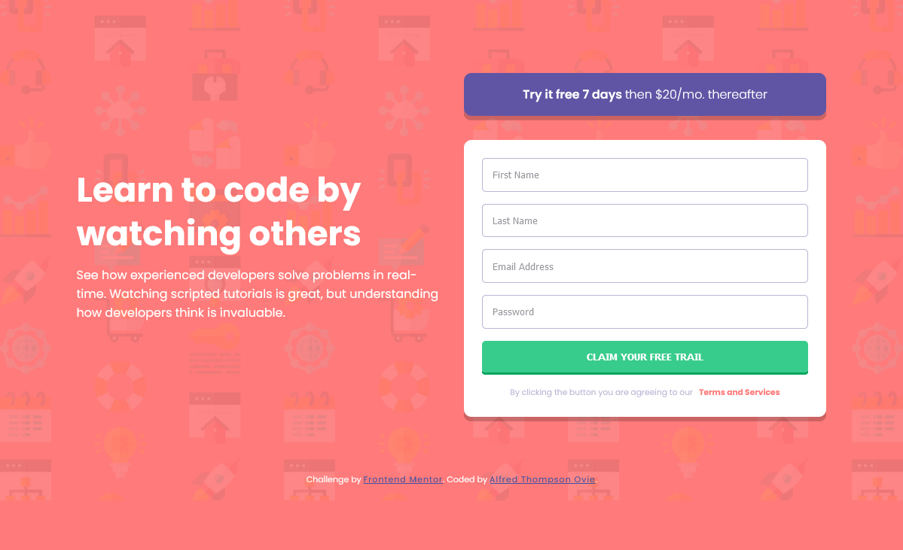

# Frontend Mentor - Intro component with sign up form solution

This is a solution to the [Intro component with sign up form challenge on Frontend Mentor](https://www.frontendmentor.io/challenges/intro-component-with-signup-form-5cf91bd49edda32581d28fd1). Frontend Mentor challenges help you improve your coding skills by building realistic projects. 

## Table of contents

- [Overview](#overview)
  - [The challenge](#the-challenge)
  - [Screenshot](#screenshot)
  - [Links](#links)
- [My process](#my-process)
  - [Built with](#built-with)
  - [What I learned](#what-i-learned)
  - [Continued development](#continued-development)
  - [Useful resources](#useful-resources)
- [Author](#author)
- [Acknowledgments](#acknowledgments)

## Overview

## Project Setup

```sh
npm install
```

### Compile and Hot-Reload for Development

```sh
npm run dev
```

### Compile and Minify for Production

```sh
npm run build
```

### Lint with [ESLint](https://eslint.org/)

```sh
npm run lint
```

### The challenge

Users should be able to:

- View the optimal layout for the site depending on their device's screen size
- See hover states for all interactive elements on the page
- Receive an error message when the `form` is submitted if:
  - Any `input` field is empty. The message for this error should say *"[Field Name] cannot be empty"*
  - The email address is not formatted correctly (i.e. a correct email address should have this structure: `name@host.tld`). The message for this error should say *"Looks like this is not an email"*

### Screenshot



This is a screenshot of my solution. 

### Links

- Solution URL: [solution URL](https://github.com/alfredthompsonOvie/intro-component-with-signup-form-vee)
- Live Site URL: [live site URL](https://eivo-intro-component-with-signup-form.netlify.app)

## My process

### Built with

- Semantic HTML5 markup
- CSS custom properties
- Flexbox
- CSS Grid
- Mobile-first workflow
- [Vue3](https://vuejs.org/) - JS library
- [VeeValidate](https://vee-validate.logaretm.com/v4/) - vue validation library

### What I learned

I learnt how to validate form fields using veeValidate's component api and how to create custom error messages 


### Continued development

I still have a long way to go when it comes to validating forms, like exploring other ways of validating forms

### Useful resources

- [VeeValidate](https://vee-validate.logaretm.com/v4/) - This helped me to validate the input fields. There are two ways of validating form fields component api and composition api, started with component api I think this pattern gets the job done.


## Author

- Frontend Mentor - [@alfredthompsonOvie](https://www.frontendmentor.io/profile/alfredthompsonOvie)
- Twitter - [@Eivo_official](https://www.twitter.com/eivo_official)
